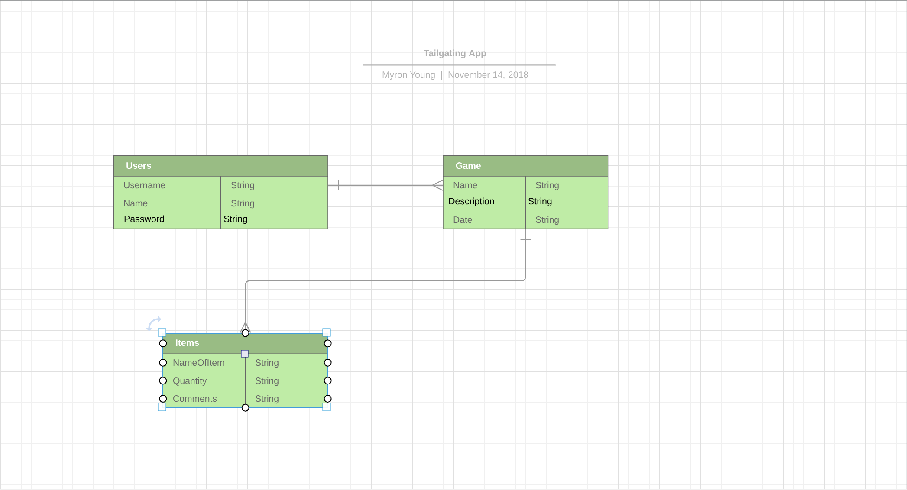

# Tailgater-WDI18-Project-3
Project #3 for WDI18 at General Assembly
View the App: [Tailgater](https://tgatekeeper.herokuapp.com/)

## Overview

This app is all about organizing for tailgating events and ensuring that everyone has everything for a good time. After I graduate from college, I always enjoy bonding with friends at tailgating events. During the events, even when planning out the day, between reviewing the event through Facebook, and other social media platforms, it's hard to keep track of what each person will bring and having a visual of what's needed. With Tailgater, you're able to view your games, and explore whats needed or being brought for each tailgate.

## Technologies Used

- Languages - HTML5, CSS3, Javascript, Node.js, MongoDB, Mongoose,Express, React
- Design - Google Fonts, 
- Coded in VS Code

## User Stories and Implementation

- My [Trello](https://trello.com/b/LTOcHtT2/wdi-project-3)

## Wireframe

[My Framework](https://www.figma.com/file/gpOY3SXithNHJmXQcXefJ4dg/Tailgater?node-id=0%3A1)

## ERD

## Future Developments

- Have all users be able to view all event
- Adding a Weather API for planning the day
- Adding  Google Maps API for location of the event
- Have all models use full CRUD

